<head>
  <html data-theme="dark" />

  <meta
    name="description"
    content="A $1,000,000+ machine learning and computer vision competition"
  />

  <meta property="og:type" content="website" />
  <meta property="og:url" content="https://scrollprize.org" />
  <meta property="og:title" content="Vesuvius Challenge" />
  <meta
    property="og:description"
    content="A $1,000,000+ machine learning and computer vision competition"
  />
  <meta
    property="og:image"
    content="https://scrollprize.org/img/social/opengraph.jpg"
  />

  <meta property="twitter:card" content="summary_large_image" />
  <meta property="twitter:url" content="https://scrollprize.org" />
  <meta property="twitter:title" content="Vesuvius Challenge" />
  <meta
    property="twitter:description"
    content="A $1,000,000+ machine learning and computer vision competition"
  />
  <meta
    property="twitter:image"
    content="https://scrollprize.org/img/social/opengraph.jpg"
  />
</head>

import { TutorialsTop } from '@site/src/components/TutorialsTop';

These tutorials share the best tools and techniques for virtually unwrapping and reading carbonized papyrus scrolls.

We expect you will build on these techniques, improving the tools and models. But of course, you may have better ideas, and are free to approach the Vesuvius Challenge any way you think will work!

There are four steps in our process for reading a carbonized scroll:

<TutorialsTop/>

1. <b>Scan:</b> use X-ray tomography to create a 3D scan of a scroll or fragment. The digital twin is a volumetric image where each voxel (3D pixel) represents the average density of the material at the scan resolution.
2. <b>Segmentation::</b> mapping and transforming the written surface into a flat, 2D projection and sampling nearby voxels to create a flattened volume that contains all surface features.
3. <b>Ink Detection:</b> identifying the inked regions in the flattened surface volume using a machine learning model
4. <b>Read:</b> decipher ink strokes, interpret meaning, unlock history

### Where we are now

Before we dive into the Herculaneum papyri with their [radiolucent](https://en.wikipedia.org/wiki/Radiodensity) ink, it's helpful to understand how the En-Gedi scroll was virtually unwrapped in 2015.

Here is an excellent 2 minute overview of how this was achieved:

<iframe className="w-[100%] aspect-video mb-4" src="https://www.youtube.com/embed/GduCExxB0vw" title="YouTube video player" frameBorder="0" allow="accelerometer; autoplay; clipboard-write; encrypted-media; gyroscope; picture-in-picture; web-share" allowFullScreen/>

For the Herculaneum papyri, many of the same steps apply, with one key change - the ink is much less readily visible. There is much room for improvement in each step of the pipeline: We can currently only read 5% of a complete scroll. We would like to read 90% in 2024. That is your goal!

Let's go through each of the key steps one by one.

### 1. Scan

<strong>Input:</strong> physical scroll or fragment. 
<strong>Output:</strong> 3D scan volume (voxels in .tif “image stack”)

If you've ever had a CT scan at a hospital, this is the same process, except our scans were made in a particle accelerator and are much higher resolution.

Scanning involves capturing hundreds to thousands of X-ray photographs of the object from different rotational angles. Typically this is accomplished using an X-ray source on one side of the object, and an X-ray camera on the other side, and rotating the object 360° on a platform.

<figure className="">
  <video autoPlay playsInline loop muted className="w-[100%]" poster="/img/tutorials/fragment-rotating2.jpg">
    <source src="/img/tutorials/fragment-rotating2.webm" type="video/webm"/>
    <source src="/img/tutorials/fragment-rotating2.mp4" type="video/mp4"/>
  </video>
  <figcaption className="mt-0">A fragment rotating, with an X-ray source (from a particle accelerator) on one side, and an X-ray camera on the other side <a href="https://www.youtube.com/watch?v=fg_08ukGlMw">(source)</a></figcaption>
</figure>

The X-ray photos are combined into a 3D scan volume using [tomographic reconstruction](https://en.wikipedia.org/wiki/Tomographic_reconstruction) algorithms, typically by software that comes with the scanner. A volume is a 3D picture made up of 3D pixel cubes called voxels. The voxel size tells us the physical size of the cube, and the value stored in the voxel is that location's relative radiodensity.

<figure>
  <video autoPlay playsInline loop muted className="w-[100%] rounded-xl" poster="/img/tutorials/scanning2.jpg">
    <source src="/img/tutorials/scanning2.webm" type="video/webm"/>
    <source src="/img/tutorials/scanning2.mp4" type="video/mp4"/>
  </video>
  <figcaption className="mt-0">Artistic visualization of constructing a 3D volume; in reality the object rotates as it is scanned.</figcaption>
</figure>

We store the 3D scan volume as a directory full of .tif files, where each file represents one horizontal cross-section or "slice" of the object, typically starting at the bottom of the scroll or scroll fragment and moving upwards. We call this a .tif image stack. You can view and explore a 3D scan volume of a scroll in your browser right now in [one click](https://dl.ash2txt.org/view/Scroll1), or with a few lines of code ([Python](https://github.com/ScrollPrize/vesuvius), [C](https://github.com/ScrollPrize/vesuvius-c)).

Remember that each pixel in the image stack actually represents a cube (voxel) of physical space. If your volume has a 10um voxel size, then 100 slices will be 1mm (1000um) of the object.

  
<figcaption className="mt-0">Scroll 1 (PHerc. Paris. 4)</figcaption>

<iframe className="w-[100%] max-w-[500px] mb-4 aspect-square" src="https://www.youtube.com/embed/cY5BIxkf5m0"  title="YouTube video player" frameBorder="0" allow="accelerometer; autoplay; clipboard-write; encrypted-media; gyroscope; picture-in-picture; web-share" allowFullScreen></iframe>

Image stacks can be visualized using 3D volume rendering software. We will learn how to do this in the [Scanning Tutorial](tutorial1).

### 2. Segmentation

<strong>Input:</strong> 3D volume (.tif “image stack”). 
<strong>Output:</strong> 3D flattened “surface volume” (.tif “image stack”)

The goal of segmentation is to map and capture information near the written surface of the rolled papyrus scroll. Each section of the written surface that we have mapped within the 3D volume and converted into a surface volume is called a "segment".

<figure>
  <video autoPlay playsInline loop muted className="w-[100%] rounded-xl" poster="/img/tutorials/segmentation2.jpg">
    <source src="/img/tutorials/segmentation2.webm" type="video/webm"/>
    <source src="/img/tutorials/segmentation2.mp4" type="video/mp4"/>
  </video>
  <figcaption className="mt-0">Segmentation: finding a surface of papyrus.</figcaption>
</figure>

There are four steps to segmentation:

* **Map.** Working from the chosen representation, map the surface (VC, Khartes, Thaumato) or volume (Slicer, Napari, Dragonfly) of the targeted scroll section.
* **Mesh.** Once the surface has been mapped in three dimensions, we need to start preparing the ground to visualize the results. In computer vision, the common approach is triangulating the surface obtaining a “triangular mesh”. Triangular meshes allow coherent texturization and rendering of the surface for both enhanced 3D visualization and flattened 2D visualization. The triangular mesh is stored in a “.obj” file. 
* **Subvolume.** Sample voxels around the mesh to extract a subvolume containing information around the surface (surface volume).
* **Flatten.** Transform this subvolume into a new .tif image stack where each layer is 2D, similar to creating a map of the earth on flat paper

The output of this process is a flattened 3D volume of the voxels around the mapped surface, which we call a “surface volume”. This is again a .tif image stack, just like our original volume. However, it is much smaller than the original volume and more consistent since the papyrus always sits roughly in the middle of the volume.

In ["Tutorial: Segmentation and Flattening"](tutorial3) we’ll dive deeper into segmentation and virtual unwrapping.

### 3. Ink detection

<strong>Input:</strong> 3D “surface volume” around the mesh (.tif “image stack”), hand-labeled binary mask 
<strong>Output:</strong> Predicted ink mask

We use machine learning models to detect ink, training them on previously identified regions of ink. The trained models predict new regions of ink, which can be iteratively added to the training sets.

<figure>
  <video autoPlay playsInline loop muted className="w-[100%]" poster="/img/tutorials/ink-detection-anim2-dark.jpg">
    <source src="/img/tutorials/ink-detection-anim2-dark.webm" type="video/webm"/>
    <source src="/img/tutorials/ink-detection-anim2-dark.mp4" type="video/mp4"/>
  </video>
</figure>

Regions that contain ink can also be located via “persistent direct visual inspection” - staring at the surface volume images to identify characteristics of ink signal (crackle).

Fragments have exposed regions of ink on the surface that can be photographed. The visibility of the ink is enhanced with IR imaging. IR photographs have been aligned with surface volumes of the top layer and included alongside binary masks for each fragment. Most fragments consist of multiple layers adhered together, which can be segmented to search for hidden ink.

We go into great detail in [“Tutorial 5: Ink Detection”](tutorial5).

### 4. Read

<strong>Input:</strong> One or more predicted ink masks. 
<strong>Output:</strong> Words, sentences, whole books, translations, journal papers, worldwide news coverage, eternal fame.

<figure className="">
  <video autoPlay playsInline loop muted className="w-[100%]" poster="/img/tutorials/engedi-reconstruction3.webm">
    <source src="/img/tutorials/engedi-reconstruction3.webm" type="video/webm"/>
    <source src="/img/tutorials/engedi-reconstruction3.mp4" type="video/mp4"/>
  </video>
  <figcaption className="mt-0">En-Gedi reconstruction of multiple segments, showing Hebrew text. Can you read it? <a href="https://www.youtube.com/watch?v=tL7rhIFNtQg">(source)</a></figcaption>
</figure>

Your work ends at ink detection. But for the world's papyrologists and classicists, this is where the excitement begins! Papyrologists can often extract more information than you might think. They are used to working with damaged, incomplete information, interpreting it, putting it into a historical context, and making history.

### Visual summary

```mermaid
%%{init: {'theme':'dark'}}%%
graph TD

classDef substep fill:#223B46

Scanning["1. Micro-CT scan"]:::substep
Papyrus([Papyrus scroll]) --> Scanning --> tif[/"Scroll volume (.tif stack)"/]

Segmentation["2. Segmentation"]:::substep
tif --> Segmentation --> obj[/"3D mesh (.obj)"/]

Volumes["3. Flattening and rendering"]:::substep
tif --> Volumes
obj --> Volumes
Volumes --> surfVol[/"Surface volume (.tif stack)"/]

Alignment["4. Ground data truth alignment"]:::substep
Infrared[/Infrared photo/] --> Alignment --> alInf[/Aligned infrared/] --> labels[/Hand-labeled binary mask/]
surfVol --> Alignment

Ink["5. Ink detection"]:::substep
surfVol --> Ink
labels --> Ink --> predInk[/Ink predictions/]

Interpretation["6. Interpretation"]:::substep
predInk --> Interpretation --> Knowledge([New knowledge])
```

